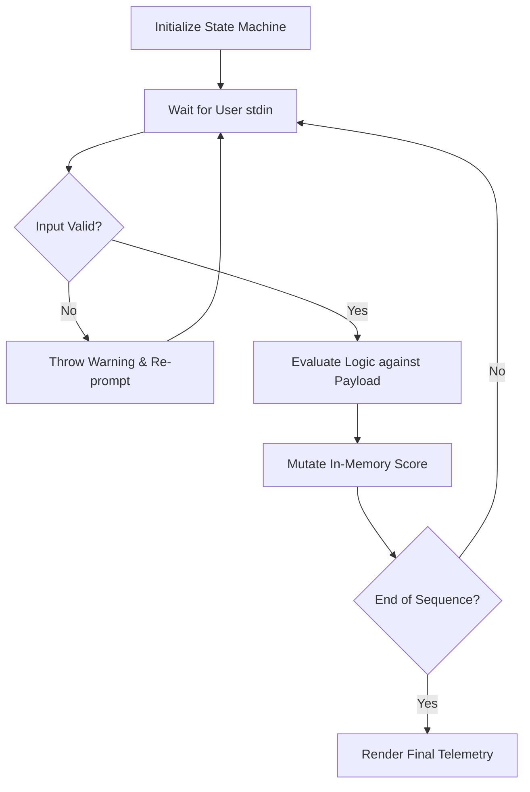

# Terminal Applications: Interactive CLI Framework

[]()
[]()
[]()

## Overview
This repository functions as a foundational systems engineering application, demonstrating how to architect stateful Command Line Interfaces (CLIs) in Python. Framed conceptually as an "Interactive Quiz Game", the underlying architecture is a robust state machine that parses user `stdin`, evaluates conditional matrices against a static payload, and dynamically mutates scoring variables in real-time.

## Problem Statement
Developing intuitive terminal interfaces is a core requirement for DevSecOps and backend engineers (e.g., building internal deployment CLIs). Many scripts fail because they cannot gracefully handle unexpected user input or strictly manage execution state during recursive loops. This repository solves that by providing a baseline architecture for safe `stdin` ingestion, input sanitization, and state-driven terminal routing.

## Key Features
- **State Machine Architecture:** Explicit control flow managing the transitions between application launch, input ingestion, scoring mutations, and termination.
- **`stdin` Sanitization:** Defensively parsing terminal inputs to prevent unexpected execution panics when users submit unformatted data types.
- **In-Memory State Tracking:** Secure, scoped variables that maintain the running score and historical answers without relying on external databases.
- **Terminal UX/UI:** Utilizing Python's `print()` mechanics with carriage returns and structured formatting to emulate a GUI within a bash environment.

## Architecture



## Technology Stack
- **Language:** Python 3.11
- **Interface:** Terminal `stdin` / `stdout`
- **Testing:** `pytest` (Abstract Syntax Tree Validation)
- **Documentation:** GitHub Flavored Markdown (GFM)

## Project Structure
```text
interactive-quiz-game/
├── projects/                # Core application payloads
├── tests/                   # Automated Pytest CI verification
└── README.md                # System documentation
```

## Installation
Ensure Python 3 is installed natively on your OS. No external `pip` dependencies are required.
```bash
git clone https://github.com/krsna016/interactive-quiz-game.git
cd interactive-quiz-game/projects
```

## Usage
Execute the script natively via the terminal to instantiate the interactive loop:
```bash
python3 main.py
```

## Examples
*Example of safe input sanitization logic during a state-loop:*
```python
while True:
    user_input = input("Enter selection (A/B/C/D): ").strip().upper()
    if user_input in ['A', 'B', 'C', 'D']:
        break
    print("Invalid Input. Please strictly enter A, B, C, or D.")
```

## Screenshots
> [!NOTE]
> *Utility and OS-level repositories execute via standard terminal output without GUI interactions.*

## Visual Demonstrations
> [!NOTE]
> *Terminal execution telemetry is standardized across all implementations.*

## Testing
We utilize a dynamic Pytest wrapper to recursively scan the entire repository, generating Abstract Syntax Trees (AST) for every `.py` file to mathematically prove zero syntax errors exist across the archive, ensuring the CLI will not crash at compile time.
```bash
pytest tests/
```

## Performance Notes
- **Thread Blocking:** The application intentionally blocks the main execution thread while awaiting `input()` resolution from the user. This is an expected behavioral requirement for linear CLIs.

## Future Improvements
- **Argument Parsing:** Upgrade the application to utilize the native `argparse` or external `Click` library to allow users to pass configuration flags on boot (e.g., `python3 main.py --difficulty hard`).
- **Data Persistence:** Integrate Python's `json` library to write final user scores out to an external `ledger.json` file, granting the application cross-execution state persistence.

## Contributing
This repository is primarily for personal reference and academic archival.

## License
Licensed under the MIT License.
